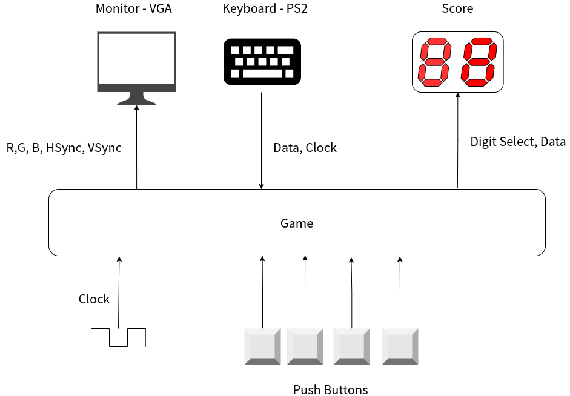

# EasyFPGA-RedChase

A little game made with the RZ-EasyFPGA A2.2 board!

Builds upon the project available at [EasyFPGA-VGA](https://github.com/fsmiamoto/EasyFPGA-VGA). 
You can checkout the README there for more details on how to flash the code to your board.

## Board interfaces

The following I/O interfaces of the board were used in this project:

- VGA: Used for displaying the game
- PS2: Attached to a keyboard for use as a input
- 7 Segment displays: Used to show the current score
- Push-buttons: Used for resetting the game

For the system clock, we use the 50MHz one provided by board and use clock
dividers where needed.

## Gameplay

The mechanics of the game are pretty simple:

*Avoid hitting the edges of the screen while chasing the red apple for scoring points*.

But here's the catch, **every time you score the speed of the green square increases**.

As you continue to gather points, it will become increasingly difficult to catch the next
red apple and avoid the edges.

### States

In the game you can basically be in one of the following three states:
- *Start*: In this one you have to press any key to start playing.
- *Playing*: You're now playing and should start to gather points.
- *Dead*: Well, you've just lost. But can check out your score on the Seven Segment displays and take note of you record :D

You can always get back to the *Start* state by pressing the reset button, which is the rightmost push button on the board.

## Contributing

If you'd like to contribute with any fixes or improvements, feel free to open a PR or create an issue.
